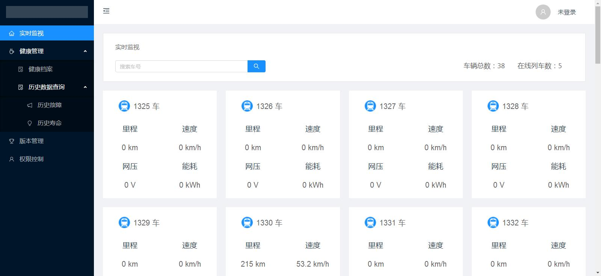
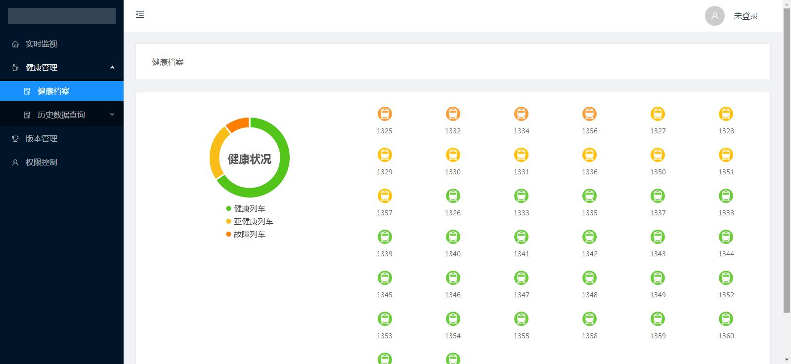
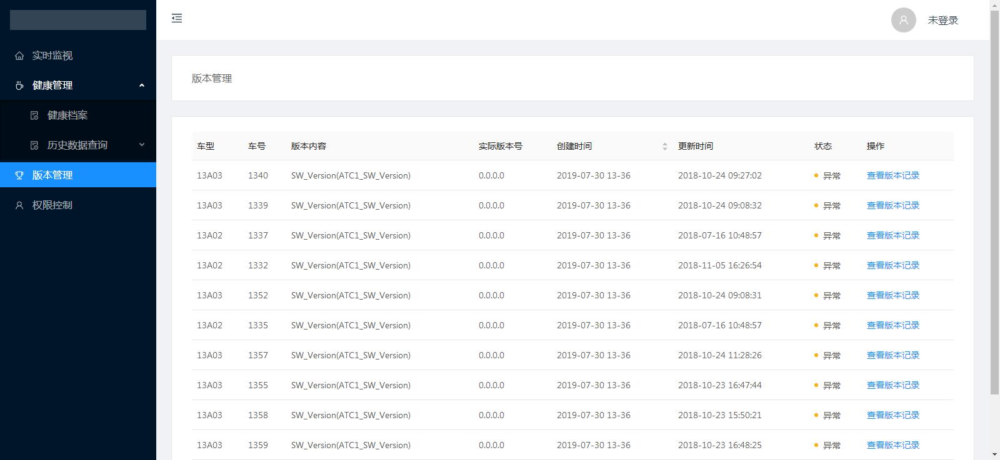
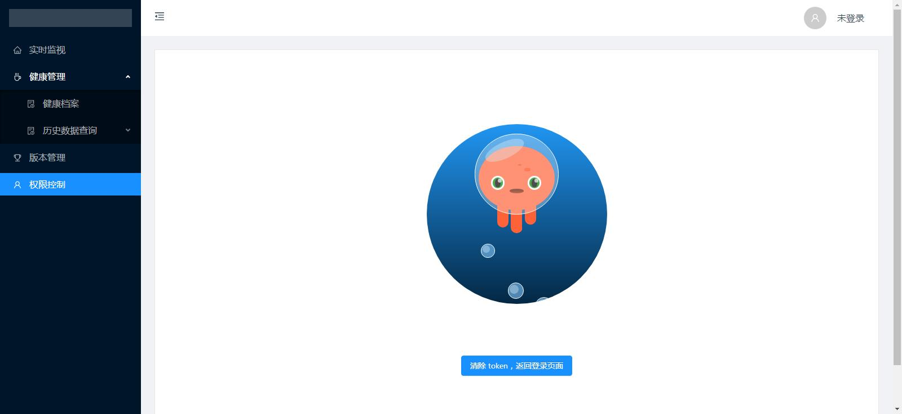

# ant-vue

> A Vue.js project

## 相关技术

vue@2.5.2 + vuex@3.0.1 + vue-router@3.0.1 + axios@0.18.0 + websocket + ant-design-vue@1.1.1 + echarts@4.2.0

### 如何运行

npm install

npm start

访问 localhost:3000

### 截图

### 登录

### 实时监视

### 健康管理

### 版本管理

### 权限控制

项目在线地址：https://doraemonnn.github.io/Ant-Vue-Train/dist/index.html#/home

For a detailed explanation on how things work, check out the [guide](http://vuejs-templates.github.io/webpack/) and [docs for vue-loader](http://vuejs.github.io/vue-loader).
